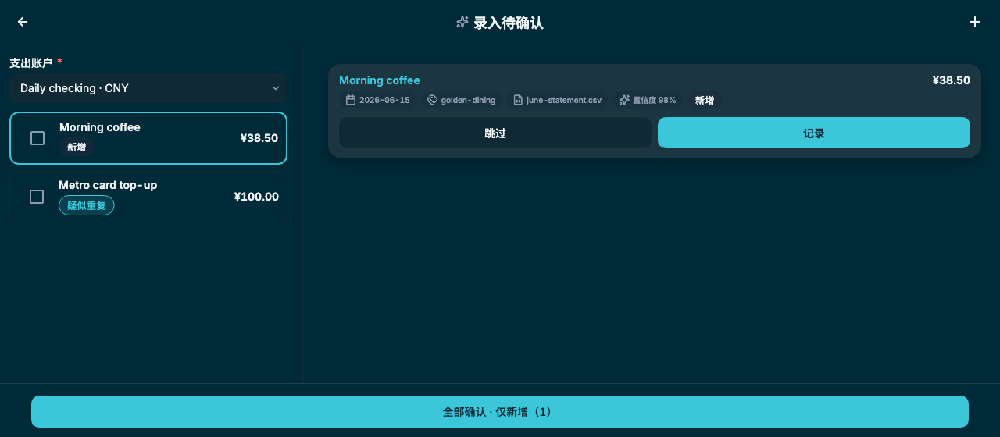
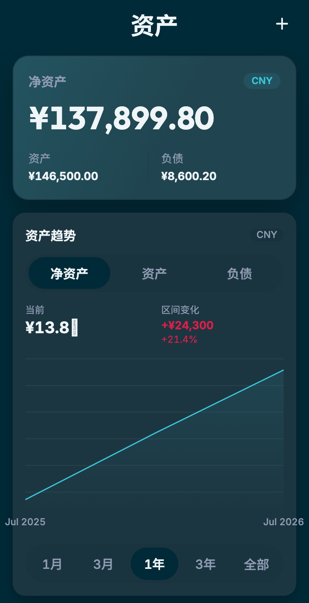
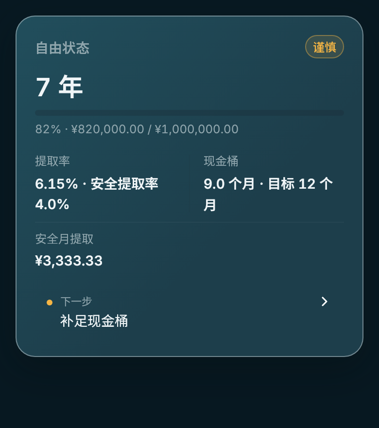
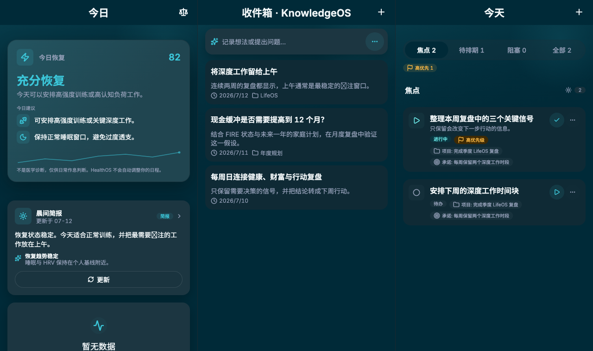

<p align="center">
  
</p>

<h1 align="center">NaviWealth</h1>

<p align="center">
  <strong>本地优先的个人 LifeOS</strong><br>
  在一个由你掌控的数据系统中，连接财富、健康、知识与行动。
</p>

<p align="center">
  Local-first · Device AI · Multi-domain · iOS / Android / Web
</p>

<p align="center">
  <a href="https://github.com/zsh-a/NaviWealth/releases/latest"></a>
  <a href="https://github.com/zsh-a/NaviWealth/actions/workflows/mobile.yml"></a>
  <a href="https://github.com/zsh-a/NaviWealth/actions/workflows/backend.yml"></a>
</p>

<p align="center">
  <a href="https://naviwealth.pages.dev">在线体验 Web Demo</a>
  ·
  <a href="https://github.com/zsh-a/NaviWealth/releases/latest">下载最新版</a>
  ·
  <a href="#快速开始">本地运行</a>
  ·
  <a href="docs/index.md">阅读文档</a>
</p>

---

## 一个系统，看见生活的全貌

NaviWealth 从 FinanceOS 出发，但不止于记账。它把分散的生活数据组织成可以理解、追踪和行动的个人系统：数据优先保存在设备上，AI 出现在当前任务中，所有重要写入都由用户确认。

<p align="center">
  <a href="https://naviwealth.pages.dev">
    
  </a>
</p>

<p align="center">
  <sub>SMART INGEST · DESKTOP</sub><br>
  <strong>从原始信息到可确认的结构化记录</strong><br>
  <sub>文件、粘贴与截图只生成候选项；每一笔记录都由你确认后写入。</sub>
</p>

<table width="100%">
  <tr>
    <td width="40%" align="center" valign="top">
      
      <br><sub>WEALTH OVERVIEW</sub><br>
      <strong>统一财富视图</strong><br>
      <sub>净资产、资产负债与趋势集中呈现。</sub>
    </td>
    <td width="60%" align="center" valign="top">
      
      <br><sub>FIRE INSIGHT</sub><br>
      <strong>把长期目标变成下一步行动</strong><br>
      <sub>解释安全提取率、现金缓冲和当前最重要的动作。</sub>
    </td>
  </tr>
</table>

<p align="center">
  
</p>

<p align="center">
  <sub>ONE LIFE · CONNECTED CONTEXT</sub><br>
  <strong>健康、知识与行动，不再是彼此孤立的数据</strong><br>
  <sub>恢复信号进入晨间简报，知识沉淀保留决策背景，承诺最终落到今天可以完成的行动。</sub>
</p>

<p align="center">
  <sub>以上界面由生产 Widget 和固定演示数据自动生成，会随产品持续更新。</sub>
</p>

## 为什么是 NaviWealth

| 本地优先 | 设备端 AI | 为行动而设计 |
|---|---|---|
| 日常数据首先进入本机 Drift 数据库，离线也能浏览和编辑。 | 使用用户自己的模型密钥直连 Anthropic 或 OpenAI-compatible provider，不经过 NaviWealth 后端。 | AI 给出证据和建议；写入、转账与外部动作始终经过明确确认。 |

## 四个可组合的 LifeOS

| Domain | 你可以用它做什么 | 状态 |
|---|---|---|
| **FinanceOS** | 管理账户、资产、现金流、投资、FIRE 与期权收入 | 始终开启 |
| **HealthOS** | 汇总睡眠、HRV、恢复信号和晨间简报 | 按需启用 |
| **KnowledgeOS** | 沉淀决策、原则、假设、例程和知识回顾 | 按需启用 |
| **ExecutionOS** | 连接行动、项目、承诺与进展复盘 | 按需启用 |

每个域通过 `DomainPack` 注册自己的页面、Agent、AI 工具和命令入口。关闭某个域不会删除它的数据，也不会让领域逻辑渗透到其他模块。

## 清晰的隐私边界

```text
你的设备
  ├─ Drift：业务数据真值
  ├─ Rust Agent Runtime：模型调用、续轮与执行预算
  ├─ Device Tools：读取本机数据并生成证据
  └─ Secure Storage：保存用户自己的 LLM profile

NaviWealth Backend
  └─ Auth + Sync v3；不持有模型密钥，不转发 AI 请求
```

- AI 仅在原生平台启用；Web 不加载 AI runtime 或 Health 平台集成。
- Sync v3 使用行状态 LWW、accepted acknowledgements 和 domain generations。
- AI trace、记忆向量、草稿和派生缓存默认只保存在本机。
- 外部副作用不会由模型自动执行。

## 平台支持

<p>
  <a href="https://naviwealth.pages.dev"><strong>打开 Web Demo →</strong></a>
</p>

Web Demo 可直接体验核心数据、FinanceOS 和跨端界面；受浏览器安全边界限制，不提供设备端 AI 与 Health 平台集成。

| 平台 | 核心数据 | 云同步 | 设备端 AI | Health 集成 |
|---|:---:|:---:|:---:|:---:|
| iOS / Android | ✓ | ✓ | ✓ | ✓ |
| Web | ✓ | ✓ | — | — |

> NaviWealth 仍在积极开发中。升级前请关注 [Release Notes](https://github.com/zsh-a/NaviWealth/releases)，并为重要数据保留备份。

## 快速开始

### 运行 Flutter App

```bash
git clone https://github.com/zsh-a/NaviWealth.git
cd NaviWealth/apps/mobile

flutter pub get
flutter run --dart-define=BYPASS_AUTH=true
```

Web 首次运行还需要准备 Drift 和字体资源：

```bash
tool/setup-drift-web.sh
tool/build-cn-fonts.sh
tool/build-latin-fonts.sh
flutter run -d chrome --dart-define=BYPASS_AUTH=true
```

完整环境、Backend 和设备调试说明见 [Local Development](docs/development/local-development.md)。

## 技术轮廓

| Layer | Stack |
|---|---|
| App | Flutter · Riverpod · go_router · Forui |
| Local data | Drift · SQLite · secure storage |
| Device runtime | Rust · flutter_rust_bridge · EmbeddingGemma ONNX |
| Sync backend | Cloudflare Workers · Rust · D1 |
| AI providers | Anthropic · OpenAI-compatible profiles |

架构的核心原则很简单：`core/` 保持领域中立，业务能力属于各自 domain，`app/` 只负责组合。详细设计见 [Architecture Northstar](docs/architecture/lifeos-architecture-northstar.md) 和 [LifeOS Shell](docs/architecture/lifeos-shell.md)。

## 文档导航

| 主题 | 文档 |
|---|---|
| 项目总览 | [Documentation Index](docs/index.md) |
| Agent 任务路由 | [Agent Task Map](docs/agent-map.md) |
| FinanceOS | [FinanceOS Domain](docs/domains/financeos-domain.md) |
| 设备端 AI | [AI Architecture](docs/ai/ai-architecture.md) · [Runtime Contract](docs/ai/ai-protocol.md) |
| Agent Runtime | [Current Architecture](docs/architecture/agent-runtime-current.md) |
| 数据同步 | [Sync v3](docs/sync/sync-v3.md) |
| 测试策略 | [Testing Strategy](docs/development/testing-strategy.md) |
| 产品路线 | [LifeOS Roadmap](docs/roadmap/roadmap-lifeos.md) · [FinanceOS Roadmap](docs/roadmap/roadmap-finance.md) |

<details>
<summary><strong>开发者工作流</strong></summary>

### 常用检查

```bash
cd apps/mobile
dart format .
flutter analyze --fatal-infos
flutter test
```

```bash
cd apps/backend
cargo fmt --all -- --check
cargo clippy --target wasm32-unknown-unknown --all-targets -- -D warnings
cargo check --target wasm32-unknown-unknown
```

### 自动刷新 README 效果图

```bash
cd apps/mobile
./tool/update-readme-screenshots.sh --update
```

效果图使用固定 Flutter、字体、locale、viewport 和演示数据。PR 会生成预览 artifact；UI 合并到 `main` 后，CI 在图片变化时自动创建刷新 PR。详见 [Visual Baseline](docs/visual-baseline/README.md)。

### 仓库入口

```text
apps/mobile/                     Flutter App
apps/mobile/native/lifeos_native Rust 设备端运行时
apps/backend/                    Cloudflare Workers Backend
docs/                            当前架构、领域和开发文档
tool/                            质量门禁与项目工具
```

安装 Git hooks：

```bash
./tool/install-hooks.sh
```

</details>

## 参与项目

欢迎通过 Issue 提交问题、场景和设计建议。代码贡献请从 `main` 创建短分支，完成相关测试后提交 Pull Request；分支保护和必需检查见 [Branch Protection](docs/operations/branch-protection.md)。

<p align="center">
  <sub>Build a calmer, more private operating system for personal life.</sub>
</p>
